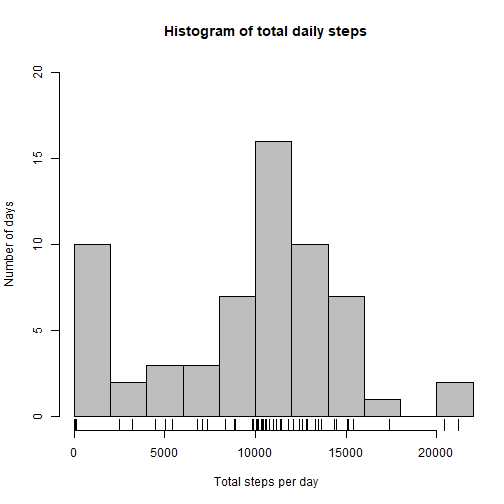
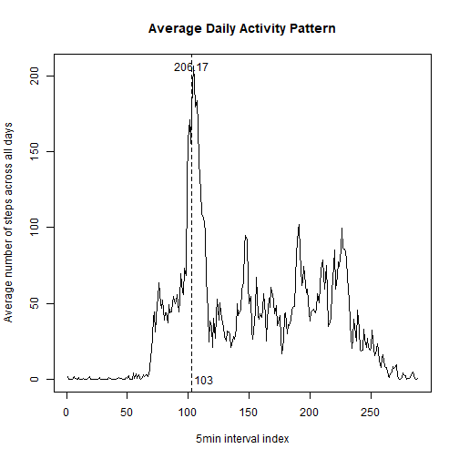
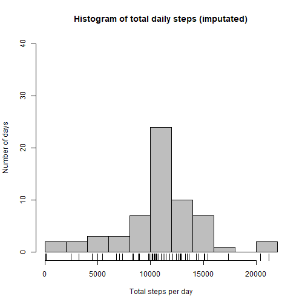
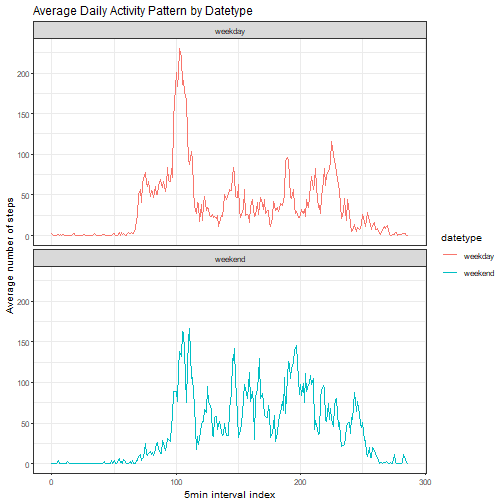

Peer-graded Assignment: Course Project 1
===========================================================


## Loading and preprocessing the data    


```r
library(lubridate)
library(ggplot2)
activity <- read.csv("activity.csv", header = T)
activity$year <- year(activity$date)
activity$mon <- month(activity$date)
activity$day <- day(activity$date)
activity$stepID <- rep(0:287, 61)
```


## What is mean total number of steps taken per day?  

1. Calculate the total number of steps taken per day.    
2. If you do not understand the difference between a histogram and a barplot, research the difference between them. Make a histogram of the total number of steps taken each day.  
3. Calculate and report the mean and median of the total number of steps taken per day.  


```r
totalsteps_date <- with(activity, tapply(steps, date, sum, na.rm=TRUE))
hist(totalsteps_date, 
     xlab = "Total steps per day", 
     ylab = "Number of days", 
     main = "Histogram of total daily steps", 
     col = 16,
     xlim = c(0, max(totalsteps_date)),
     ylim = c(0,20),
     breaks = 10
     )
rug(totalsteps_date)
```



```r
mean_steps <- mean(totalsteps_date, na.rm=TRUE)
median_steps <- median(totalsteps_date, na.rm=TRUE)
```

**The mean and median of the total number of steps taken per day is 9354.2295082 and 10395.**


## What is the average daily activity pattern?  

1. Make a time series plot (i.e. type="l") of the 5-minute interval (x-axis) and the average number of steps taken, averaged across all days (y-axis)  
2. Which 5-minute interval, on average across all the days in the dataset, contains the maximum number of steps?  


```r
step_aveAlldays <- with(activity, tapply(steps, stepID, mean, na.rm=TRUE))

plot (step_aveAlldays, type = "l", xlab = "5min interval index", ylab = "Average number of steps across all days", main = "Average Daily Activity Pattern")

max_interval <- max(step_aveAlldays)
max_intervalID <- as.numeric(names(which.max(step_aveAlldays)))
abline (v = max_intervalID, lty=2)
text (x = max_intervalID, y = max_interval, labels = round(max_interval, digits =2) )
text (x = max_intervalID + 10, y = 0, labels = max_intervalID)
```



**The 103th interval contains the maximal averaged number of steps (= 206.1698113) across all days. Note that the first interval is designated as 0th interval.** 


## Imputing missing values

Note that there are a number of days/intervals where there are missing values (coded as NA). The presence of missing days may introduce bias into some calculations or summaries of the data.  

1. Calculate and report the total number of missing values in the dataset (i.e. the total number of rows with NAs)  
2. Devise a strategy for filling in all of the missing values in the dataset. The strategy does not need to be sophisticated. For example, you could use the mean/median for that day, or the mean for that 5-minute interval, etc.  
3. Create a new dataset that is equal to the original dataset but with the missing data filled in.  
4. Make a histogram of the total number of steps taken each day and Calculate and report the mean and median total number of steps taken per day. Do these values differ from the estimates from the first part of the assignment?   
   What is the impact of imputing missing data on the estimates of the total daily number of steps?   
   
**NA value will be replaced by the averaged number of steps across all days for the corresponding 5-minute interval.**  

**Total number of missing values : 2304**  


```r
NA_rowID <- which(is.na(activity))
mod_NA_rowID <- (NA_rowID -1)  %% 288 +1

imputated_activity <- activity
imputated_activity$steps [NA_rowID] <- step_aveAlldays [mod_NA_rowID]

totalsteps_date1 <- with(imputated_activity, tapply(steps, date, sum, na.rm=TRUE))
hist(totalsteps_date1, 
     xlab = "Total steps per day", 
     ylab = "Number of days", 
     main = "Histogram of total daily steps (imputated)", 
     col = 16,
     ylim = c(0, 40),
     breaks = 10
     )
rug(totalsteps_date1)
```



**After imputation, the mean of the total number of steps taken per day is**

```r
mean(totalsteps_date1, na.rm=TRUE)
```

```
## [1] 10766.19
```

**After imputation, the median of the total number of steps taken per day is**

```r
median(totalsteps_date1, na.rm=TRUE)
```

```
## [1] 10766.19
```


**If the mean number of 5min-interval steps across all days is used for imputation, the mean of total number of steps taken per day will not change, whereas the median will be closer/equal to mean. The opposite is true if the median number is used.**  


## Are there differences in activity patterns between weekdays and weekends?
For this part the Weekdays() function may be of some help here. Use the dataset with the filled-in missing values for this part.

1. Create a new factor variable in the dataset with two levels – “weekday” and “weekend” indicating whether a given date is a weekday or weekend day.  
2. Make a panel plot containing a time series plot (i.e. type = "l") of the 5-minute interval (x-axis) and the average number of steps taken, averaged across all weekday days or weekend days (y-axis). See the README file in the GitHub repository to see an example of what this plot should look like using simulated data.  


```r
imputated_activity$datetype <- sapply(imputated_activity$date, function (x) {
                             if (weekdays(as.Date(x)) == "Sunday" | weekdays(as.Date(x))  == "Saturday") 
                             {y <- "weekend"} else
                             {y <- "weekday"}
                             y })
imputated_activity <- transform (imputated_activity, datetype= factor(datetype))

step_aveAlldays_1 <- with(imputated_activity, aggregate(steps, list (stepID = stepID , datetype = datetype), mean, na.rm=TRUE))

g <- ggplot (step_aveAlldays_1, aes(x = stepID, y = x, color = datetype))
g + geom_line() + facet_wrap(.~datetype, nrow =2, ncol = 1) + theme_bw(base_size = 10) + labs (x = "5min interval index", y = "Average number of steps", title = "Average Daily Activity Pattern by Datetype")
```




